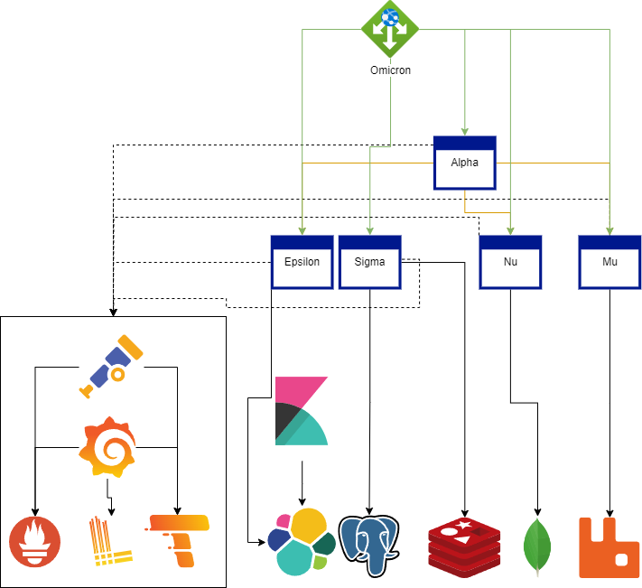

# .NET OpenTelemetry Demo

[](https://stand-with-ukraine.pp.ua/)
[](https://github.com/mishamyte/OpenTelemetry-Demo/actions?query=workflow%3ACI)

## Terms of use

By using this project or its source code, for any purpose and in any shape or form, you grant your **implicit agreement** to all the following statements:

- You **condemn Russia and its military aggression against Ukraine**
- You **recognize that Russia is an occupant that unlawfully invaded a sovereign state**
- You **support Ukraine's territorial integrity, including its claims over temporarily occupied territories of Crimea and Donbas**
- You **reject false narratives perpetuated by Russian state propaganda**

Glory to Ukraine! 🇺🇦

## Table of contents
- [Project description](#project-description)
- [Solution architecture](#solution-architecture)
- [How to run?](#how-to-run)
- [Services overview](#services-overview)
    - [Alpha](#alpha)
    - [Epsilon](#epsilon)
    - [Mu](#mu)
    - [Nu](#nu)
    - [Omicron](#omicron)
    - [Sigma](#sigma)
- [Data flows](#data-flows)
- [Contributing](#contributing)

## Project description

This project contains example of using OpenTelemetry with .NET web applications. It uses [OTEL Collector](https://opentelemetry.io/docs/collector/) and [Grafana OSS](https://grafana.com/oss/) backend for dealing with data.

It consists of:
- [Grafana](https://grafana.com/oss/grafana/)
- [Loki](https://grafana.com/oss/loki/) (using [Serilog.Sinks.Grafana.Loki](https://github.com/serilog-contrib/serilog-sinks-grafana-loki) as a sink for projects)
- [Prometheus](https://grafana.com/oss/prometheus/)
- [Tempo](https://grafana.com/oss/tempo/)

Solution consists of multiple services that use common infrastructure building blocks:
- [Elasticsearch](https://www.elastic.co/) and [Kibana](https://www.elastic.co/kibana/)
- [MassTransit](https://masstransit-project.com/) over RabbitMQ (https://www.rabbitmq.com/)
- [MongoDB](https://www.mongodb.com/)
- [PostgreSQL](https://www.postgresql.org/) with [Npgsql](https://www.npgsql.org/), using [EF Core](https://docs.microsoft.com/en-us/ef/core/) and [Dapper](https://github.com/DapperLib/Dapper)
- [Redis](https://redis.io/) with [StackExchange.Redis](https://github.com/StackExchange/StackExchange.Redis)

## Solution architecture



## How to run?

You could run solution fully in containers, using

```shell
docker compose up --build -d
```

Or bump infrastructure up in containers with `docker compose` and run standalone projects in your IDE.

In both cases entry point will be available by address `http://localhost:5200/swagger`

## Services overview

### Alpha

*A*ggregating service. Available on `http://localhost:5201` or via API gateway on `http://localhost:5200/alpha`.

Under the hood it does two requests to `Epsilon` service, using [Refit](https://github.com/reactiveui/refit) and `Mu`, using [MassTransit's request/response feature](https://masstransit-project.com/usage/requests.html).
It is a good entrypoint to look how request will be routed through the system components.

### Epsilon

Service that uses *E*lasticsearch. Available on `http://localhost:5204` or via API gateway on `http://localhost:5200/epsilon`.

Data in elastic index is seeded on service launch. Currently it contains a single document, extracted by a simple filter.

### Mu

Service built over *M*assTransit. Available on `http://localhost:5203` or via API gateway on `http://localhost:5200/mu`.

Exposes two endpoints for `sending` command and `publishing` event. Handlers, receives this messages are in this service. Also has a handler for responding to `Alpha's` request via MassTransit.

### Nu

Service that uses Mo*n*goDB. Available on `http://localhost:5205` or via API gateway on `http://localhost:5200/nu`.

Data in MongoDB is seeded on service launch. Currently it contains a single document, extracted by a simple filter.

### Omicron

API Gateway build with [Ocelot](https://github.com/ThreeMammals/Ocelot). Acts as a reverse proxy. Available on `http://localhost:5200`.
Also aggregates downstream services' swagger docs, using [SwaggerForOcelot](https://github.com/ThreeMammals/Ocelot) project.

Exposes aggregated Swagger UI & Swagger Doc on `http://localhost:5200/swagger`.

### Sigma

Service that uses Postgre*S*QL and Redis. Available on `http://localhost:5202` or via API gateway on `http://localhost:5200/sigma`.

Exposes 3 endpoints:
- _Getting entity by id_. Using Redis over `IDistributedCache` for searching. If entity is not found - goes to SQL with EF Core
- _Getting all entities_. Loads them from SQL with `Dapper`
- _Creating entity_. Entity is created in SQL with EF Core.

## Data flows
- _Logs_. Are passed directly to Loki, using corresponding Serilog's sink.
- _Metrics_. Are exported to OTEL and scrapped by Prometheus from it.
- _Traces_. Are exported to OTEL and passed to Tempo by OTEL.

## Contributing

Contributing is welcomed here. If it is something standalone (i.e. GRPC), feel free to add a new service.
It is preferable to use a corresponding letter of greek alphabet (like `Gamma` for GRPC).
Also if it is something small, it could be appended to the existing service.
